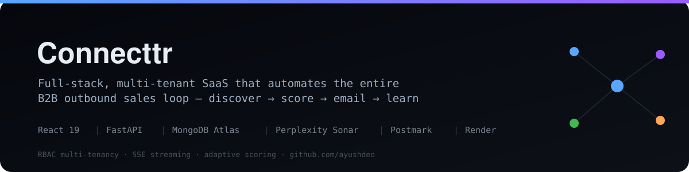
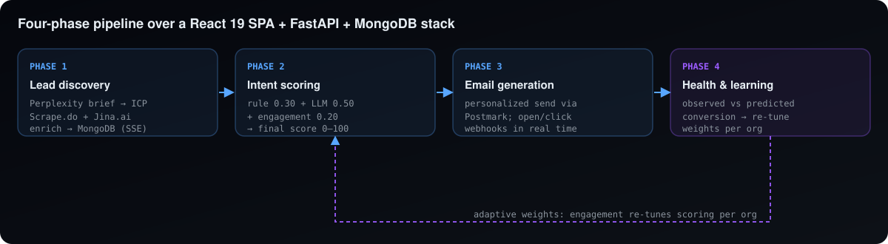

<p align="center">
  
</p>

<p align="center">
  
  
  
  
  
</p>

# Connecttr

> A **full-stack, multi-tenant SaaS** that automates the entire B2B outbound-sales loop — from finding companies that actually need a product, to enriching contacts, scoring buying intent, sending personalized email, and **learning from every reply** to re-tune itself.

B2B outbound is manually expensive: finding the right companies, getting contact info, writing personalized emails, and knowing when to follow up. Connecttr closes that loop end-to-end for each client organization, from signal detection all the way to engagement analytics.

---

## 🏗️ Architecture & pipeline

<p align="center">
  
</p>

```
React 19 (SPA)  ⇅ REST + SSE streaming ⇅  FastAPI (Python)  ⇅  MongoDB Atlas
       integrations:  Perplexity Sonar · Scrape.do · Jina.ai · Postmark · Google OAuth
       deploy:        Render (Gunicorn/UvicornWorker backend + static frontend)
```

### The four phases
1. **Lead discovery** — Perplexity Sonar turns a client's website into a structured brief (ICP, buying signals, ready-made search queries); those queries hit a JS-rendering Google proxy; results are filtered and heuristically scored; contacts are enriched (Jina.ai → BeautifulSoup fallback) and upserted to MongoDB — streamed to the UI over **SSE**.
2. **Intent scoring** — a composite 0–100 score blending `rule_score` (0.30), `llm_score` (0.50, Perplexity), and `engagement_score` (0.20 from opens/clicks/replies).
3. **Email generation & sending** — personalized templates sent via **Postmark**; open/click/reply webhooks update engagement and recompute scores in real time.
4. **Campaign health & learning** — when observed vs. predicted conversion diverges by >5% (over 30+ events), the scoring weights (`W_LLM` / `W_RULE`) are **auto-tuned in 1% increments, stored per org**.

## ✨ Engineering highlights

- **Adaptive scoring loop** — the model's weights are not static; they self-adjust from real engagement outcomes per organization.
- **Multi-tenancy & RBAC** — every query is scoped by `org_id`; roles are `owner / admin / member`; destructive actions are RBAC-gated and written to an `audit_logs` collection.
- **Streaming UX** — long-running discovery is delivered incrementally via Server-Sent Events.
- **Service auth** — the internal `/pipeline/*` API is isolated behind a separate `X-API-KEY` header.
- **Data model** — `users → organizations → campaigns → leads → emails` (+ `org_invites`).

## 🗂️ Repository structure

```
├── front-end/          # React 19 SPA — Radix UI, Tailwind, framer-motion, Google OAuth
│   └── src/            # dashboard, auth context, protected routes, UI kit
├── back-end/
│   ├── app/
│   │   ├── api/        # auth, campaigns, email_hub, intent_analytics, orgs, pipeline
│   │   ├── services/   # company_analyzer, contact_enricher, intent, learning, health
│   │   ├── ml/         # scoring / prediction
│   │   ├── models/     # org, user, audit, invite, alert
│   │   └── scripts/    # index creation, SaaS migration, phase-3 simulation
│   └── *dry_run*.py    # audit & migration dry-run tooling with reports
└── docs/               # architecture overview + phased delivery plans
```

## 🧰 Tech stack

**Frontend** `React 19` · `Radix UI` · `Tailwind` · `framer-motion` · `Google OAuth` · `jwt-decode`
**Backend** `FastAPI` · `MongoDB Atlas` · `Perplexity Sonar` · `Postmark` · `Scrape.do` · `Jina.ai`
**Infra** `Render` · Gunicorn/UvicornWorker · SSE streaming · API-key service auth

---

<sub>Author: **Ayush Deo** · MS CS @ USC · [github.com/ayushdeo](https://github.com/ayushdeo) · Full-stack + applied LLM systems</sub>
